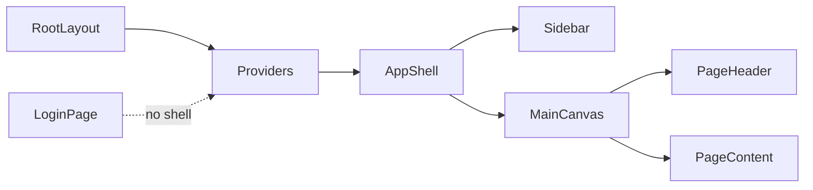

# Admin-style SIH frontend restyle

## Goal
Match the **visual/UX language** of [`references/frontend/components/admin/AdminShell.tsx`](references/frontend/components/admin/AdminShell.tsx) + [`admin-ui.tsx`](references/frontend/components/admin/admin-ui.tsx) across the whole authenticated SIH app, implemented with **SIH components** under [`apps/frontend/src/components/ui/`](apps/frontend/src/components/ui/) (`Card`, `Button`, `Input`, `Badge`, `Label`, `Separator`, `Skeleton`).

**Out of scope:** copying DeepTech tabs (Courses, CMS, SEO, SQL, Media, Students/Teachers) or importing reference components.

## Design tokens (from reference)
- Shell: `bg-black` / sidebar `#030303`, borders `white/[0.08]`, active nav `bg-blue-600/15` + left blue bar
- Surfaces: cards `rounded-[20px] border-white/[0.09] bg-[#0c0c0c]` (map onto SIH `Card` via className)
- Inputs/buttons: reuse SIH `Input`/`Button` with matching dark/blue focus classes
- Page chrome: sticky header bar + radial content background like `AdminTabPage`

## Architecture

- `/login`: full-viewport, **no** sidebar (current behavior kept, restyled to pitch-black card language)
- All other routes: wrapped in new `AppShell`

## Implementation steps

### 1. Surface helpers + theme tweaks
- Add [`apps/frontend/src/components/layout/surface.ts`](apps/frontend/src/components/layout/surface.ts) with shared class strings (`surfaceCard`, `surfacePage`, `surfaceHeader`, `navItemActive`, etc.) adapted from reference `adminCard` / `adminBtn*` — used via `cn()` on SIH `Card`/`Button`.
- Update [`apps/frontend/src/app/globals.css`](apps/frontend/src/app/globals.css) dark tokens toward pitch-black (`#090c13` → nearer `#000` / `#0c0c0c`), soft white borders; keep existing CSS variables so charts/graphs don’t break.
- Add minimal scrollbar utility (reference `admin-no-scrollbar`) if missing.

### 2. Build `AppShell` (replace top Header for authenticated pages)
- New [`apps/frontend/src/components/layout/AppShell.tsx`](apps/frontend/src/components/layout/AppShell.tsx) modeled on `AdminShell`:
  - Collapsible sidebar (`localStorage` key e.g. `sih-sidebar-collapsed`)
  - Brand block: SIH 26189 + “Criminal Network Analysis” + synthetic-data badge
  - Grouped nav (Link-based, pathname-active):
    - **Main:** Home `/`, Cases `/cases`
    - **Investigation:** Graph (case-aware), Evidence (case-aware), Team & Tasks (only when `caseId` in path)
    - **System:** Verification `/audit`, Settings `/settings`
  - Footer: username from `useAuth()`, Sign out, collapse control
- New thin [`PageHeader`](apps/frontend/src/components/layout/PageHeader.tsx) (badge / title / description / actions) for page tops.
- Change [`apps/frontend/src/app/layout.tsx`](apps/frontend/src/app/layout.tsx):
  - Keep `Providers`
  - Render `AppShell` around `children` when not on `/login`; login stays shell-less
  - Retire sticky top [`Header`](apps/frontend/src/components/layout/Header.tsx) from layout (keep file only if needed for search modal bits moved into shell, or delete unused)

### 3. Restyle login
- [`apps/frontend/src/app/login/page.tsx`](apps/frontend/src/app/login/page.tsx): keep demo-chip autofill; switch `Card`/inputs/buttons to surface tokens (black card, blue primary, white/08 borders).

### 4. Restyle all main pages (same data/API; UI only)
Apply `PageHeader` + `surfaceCard`/`Card` consistently; replace ad-hoc `bg-slate-900` / `#090c13` panels:

| Area | Files |
|------|--------|
| Home dashboard | [`app/page.tsx`](apps/frontend/src/app/page.tsx), [`components/dashboard/*`](apps/frontend/src/components/dashboard/) |
| Cases list + new | [`app/cases/page.tsx`](apps/frontend/src/app/cases/page.tsx), [`app/cases/new/page.tsx`](apps/frontend/src/app/cases/new/page.tsx) |
| Case detail | [`app/cases/[caseId]/page.tsx`](apps/frontend/src/app/cases/[caseId]/page.tsx) |
| Collaboration | [`app/cases/[caseId]/collaboration/page.tsx`](apps/frontend/src/app/cases/[caseId]/collaboration/page.tsx) |
| Graph | [`app/graph/page.tsx`](apps/frontend/src/app/graph/page.tsx), [`app/cases/[caseId]/graph/page.tsx`](apps/frontend/src/app/cases/[caseId]/graph/page.tsx), graph components as needed for chrome only |
| Evidence | [`app/evidence/page.tsx`](apps/frontend/src/app/evidence/page.tsx), [`app/cases/[caseId]/evidence/page.tsx`](apps/frontend/src/app/cases/[caseId]/evidence/page.tsx) |
| Audit / Settings | [`app/audit/page.tsx`](apps/frontend/src/app/audit/page.tsx), [`app/settings/page.tsx`](apps/frontend/src/app/settings/page.tsx) |

Preserve behavior: `api.listCases`, auth, case links, filters, delete confirm, graph viz libraries.

### 5. Verify
- `npm run type-check` and `npm run build` in `apps/frontend`
- Manual smoke: login → home → cases cards → case detail → graph/evidence/audit/settings; sidebar collapse persists; active nav highlight; no DeepTech routes

## Constraints
- Do **not** add reference package deps or copy `AdminCoursesTab` / CMS / SQL.
- Do **not** change backend APIs.
- Prefer className overrides on existing SIH UI primitives over new one-off div systems.