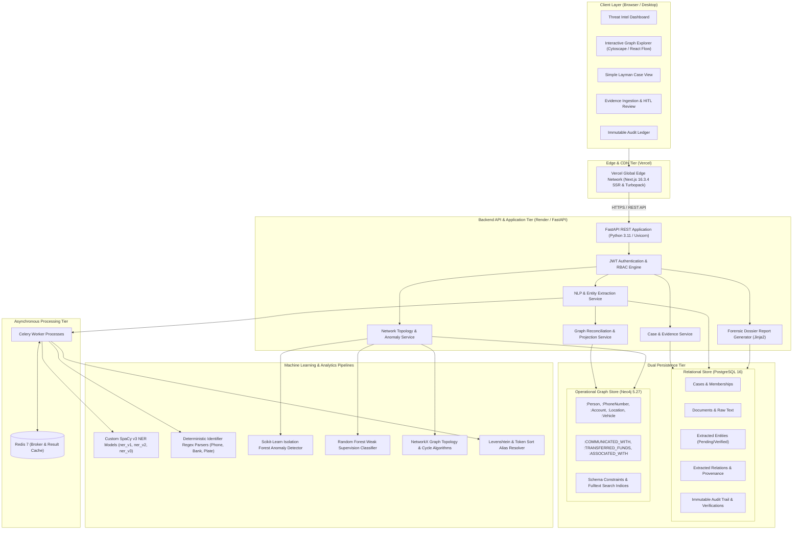

# System Architecture & Technical Specifications Deep-Dive
## SIH 26189: GoyendaBondhu – AI-Assisted Criminal Network Analysis System

---

## 1. Executive Overview & Problem Context

The **GoyendaBondhu** platform is an explainable, human-in-the-loop intelligence and criminal network analysis system developed for **Smart India Hackathon (SIH) Problem Statement 26189**. 

Investigative authorities continuously handle heterogeneous, high-volume evidence streams—including unstructured First Information Reports (FIRs), Call Detail Records (CDRs), inter-bank financial transaction logs, and witness statements. Manually connecting identities, aliases, burner phones, bank accounts, and geographic locations across disparate cases leads to missed investigative leads and severe delays.

**GoyendaBondhu** solves this by ingesting multi-source evidence, running natural language entity extraction, performing topological graph anomaly analysis, and presenting findings through an interactive network visualization and an accessible, plain-language **Simple View** for non-technical officers.

### Ethical & Regulatory Guardrails
1. **Synthetic Data Policy:** Strictly operates on synthetically generated datasets. Zero real-world PII, police records, or real phone/bank accounts are stored or processed.
2. **Zero Guilt Prediction:** The system is strictly an **investigative decision-support platform**. It does **not** predict guilt or automate criminal accusations. All model scores indicate extraction confidence or structural pattern anomaly, not culpability.
3. **Traceability & Provenance:** Every relationship and extracted node retains character-level document provenance, text snippets, and timestamps.
4. **Human-in-the-Loop (HITL):** Analysts retain full authority to `ACCEPT`, `REJECT`, or `CORRECT` model-extracted entities and relationships.

---

## 2. End-to-End System Architecture

The platform adopts a decoupled, modern multi-tier architecture separating high-performance graph/relational persistence, Python-based ML analytics, and an interactive Next.js 16 frontend.



---

## 3. Minute Technology Stacks & Framework Breakdown

### 3.1 Frontend Stack (`apps/frontend`)

| Technology | Version | Purpose & Implementation Details |
| :--- | :--- | :--- |
| **Next.js** | `16.3.4` | App Router architecture, Turbopack incremental bundler, server-rendered layouts, dynamic API proxying. |
| **React** | `19.2.8` | Core UI engine, React Server Components (RSC), Strict Mode compliance. |
| **TypeScript** | `^5.0.0` | Strict type checking (`strict: true`), zero untyped API payloads. |
| **Tailwind CSS** | `^4.0.0` | High-performance atomic styling via `@tailwindcss/postcss`. |
| **Cytoscape.js** | `^3.34.2` | Primary hardware-accelerated graph canvas supporting COSE, Dagre, and concentric layouts. |
| **@xyflow/react** | `^12.11.6` | React Flow engine for hierarchical node grouping, drag-and-drop relationship mapping, and workflow views. |
| **dagre** & **elkjs** | `^0.8.5` / `^0.12.0` | Directed acyclic graph (DAG) layout algorithms for timeline and evidence trees. |
| **Recharts** | `^3.10.1` | Anomaly distribution curves, entity degree centrality rankings, and timeline activity histograms. |
| **Framer Motion** | `^13.2.0` | Smooth drawer transitions, modal animations, and collapsible sidebar state transitions. |
| **shadcn/ui** & **Base UI** | `^4.21.0` / `^1.8.0` | Accessible component primitives (dialogs, tooltips, select menus, dropdowns, badge components). |
| **Lucide React** | `^1.42.0` | Modern, consistent icon library for tactical cyber-intel tooling. |
| **react-hot-toast**| `^2.6.0` | Non-blocking dark-themed status toasts for async verification actions. |
| **Vitest & RTL** | `^4.1.11` / `^16.3.3` | Unit and integration testing suite for components and hook logic. |

### 3.2 Backend Stack (`apps/backend`)

| Technology | Version | Purpose & Implementation Details |
| :--- | :--- | :--- |
| **Python** | `3.10 / 3.11` | Modern runtime with strict type hinting (`typing`, `Union`, `Optional`). |
| **FastAPI** | `>=0.110.0` | Asynchronous REST framework utilizing Starlette, OpenAPI auto-documentation, dependency injection. |
| **Uvicorn** | `>=0.28.0` | High-throughput ASGI production server. |
| **Pydantic** | `>=2.6.0` | Strict data validation, schema enforcement, and JSON serialization. |
| **SQLAlchemy** | `>=2.0.25` | Declarative ORM 2.0 architecture with connection pooling and session management. |
| **Alembic** | `>=1.13.0` | Database schema migration and version control management. |
| **psycopg2-binary**| `>=2.9.9` | Low-level C-optimized PostgreSQL database adapter. |
| **Neo4j Driver** | `5.27.0` | Official Bolt-protocol driver with parameterized Cypher queries and connection pooling. |
| **Celery** | `>=5.3.6` | Distributed task queue for asynchronous ingestion, embedding generation, and graph indexing. |
| **Redis** | `>=5.0.1` | In-memory message broker and result backend for Celery. |
| **PyMuPDF (fitz)** | `>=1.23.0` | High-speed PDF text, metadata, and character bounding-box extraction. |
| **python-docx** | `>=1.1.0` | Word document structure, paragraph, and table parser. |
| **python-jose** | `>=3.3.0` | Cryptographic JWT generation, decoding, and signature verification. |
| **Passlib (bcrypt)**| `>=1.7.4` | Salted password hashing with bcrypt backend for user credential security. |
| **Jinja2** | `>=3.1.2` | Server-side template rendering engine for forensic case dossiers and exportable reports. |
| **Pytest & HTTPX** | `>=8.0.0` / `>=0.27.0` | Automated API testing suite with asynchronous test client support. |

### 3.3 Machine Learning & Data Science Stack

| Library | Version | Role in GoyendaBondhu |
| :--- | :--- | :--- |
| **spaCy** | `3.7+` | Custom-trained NER pipelines (`models/ner_v1`, `ner_v2`, `ner_v3`) for Indian legal entity extraction (`PERSON`, `LOCATION`, `ORGANIZATION`, `CRIME_EVENT`). |
| **scikit-learn** | `1.4.1.post1` | **Isolation Forest** (`isolation_forest_v1.pkl`) for multi-dimensional network anomaly scoring; **Random Forest** weak supervisor. |
| **NetworkX** | `3.4.2` | Algorithmic graph analysis: PageRank, betweenness centrality, shortest path Dijkstra, and money laundering cycle detection (`find_cycle`). |
| **Faker** | `>=24.0.0` | Synthetic dataset generation engine creating realistic, privacy-compliant mock criminal case scenarios. |

---

## 4. Architectural Deep-Dive by Subsystem

### 4.1 Ingestion & NLP Extraction Pipeline

```
[Raw Evidence: PDF / DOCX / TXT / CDR]
                  │
                  ▼
         [PyMuPDF / docx Parser]
                  │ (Text Normalization & Chunking)
                  ▼
        ┌───────────────────┐
        │  Extraction Gate  │
        └─────────┬─────────┘
                  │
         ┌────────┴────────┐
         ▼                 ▼
   [SpaCy NER]      [Regex Engine]
   (People, Orgs,   (Phone: +91-XXXX,
    Locations,       Account: IFSC/Acc,
    Offence Types)   Vehicles, IPC Sections)
         │                 │
         └────────┬────────┘
                  ▼
       [Entity Resolution]
       (Levenshtein fuzzy matching & alias deduplication)
                  │
                  ▼
  [Candidate Relationship Extraction]
  (Syntactic co-occurrence + sentence-level dependency parsing)
                  │
                  ▼
  [Stored in PostgreSQL as PENDING]
                  │
                  ▼
  [Async Sync to Neo4j Canvas]
```

1. **Document Ingestion:** Multi-page documents are parsed into UTF-8 text buffers. Character offsets (`start_char`, `end_char`) are mapped to preserve 100% evidence traceability.
2. **Hybrid NER:** A dual-engine approach combines:
   - **Machine Learning NER:** Custom spaCy models trained on Indian legal and police FIR formats.
   - **Deterministic Regex:** Zero-false-negative patterns for structured identifiers (10-digit Indian phone numbers with country prefixes, bank account structures, license plates, and legal statutes like IPC/BNS sections).
3. **Entity Resolution (ER):** Disambiguates syntactic variations (e.g., `"Vikram Shah"`, `"V. Shah"`, `"Vikram"`) using Levenshtein distance metrics and token-sort fuzzy ratios to prevent duplicate graph node fragmentation.
4. **Candidate Storage:** Extracted entities and relationships are assigned confidence scores (0.00 – 1.00) and entered into the PostgreSQL database in `PENDING` state awaiting investigator validation.

---

### 4.2 Dual-Database Persistence Architecture

GoyendaBondhu relies on a **Polyglot Persistence Architecture** that pairs the transactional reliability of PostgreSQL with the traversal performance of Neo4j.

```
       ┌────────────────────────────────────────────────────────┐
       │                 FastAPI Service Layer                  │
       └──────────────┬──────────────────────────┬──────────────┘
                      │                          │
        (Transactional State & Audit)      (Graph Traversal & Patterns)
                      ▼                          ▼
       ┌─────────────────────────────┐  ┌─────────────────────────────┐
       │        PostgreSQL 16        │  │          Neo4j 5.27         │
       ├─────────────────────────────┤  ├─────────────────────────────┤
       │ • users (RBAC credentials)  │  │ • (:Person)                 │
       │ • cases (metadata, status)  │  │ • (:PhoneNumber)            │
       │ • documents (text snippets) │  │ • (:Account)                │
       │ • extracted_entities        │  │ • (:Location)               │
       │ • extracted_relationships   │  │ • (:Vehicle)                │
       │ • verification_logs         │  │ • [:COMMUNICATED_WITH]      │
       │ • audit_logs (immutable)    │  │ • [:TRANSFERRED_FUNDS]      │
       └──────────────┬──────────────┘  └──────────────┬──────────────┘
                      │                                │
                      └────────► [Graph Sync] ◄────────┘
                          (Reconciliation Engine)
```

#### PostgreSQL Schema Details
- **`users`:** Stores UUID, hashed credentials (`bcrypt`), email, and roles (`SUPER_ADMIN`, `INVESTIGATOR`, `ANALYST`, `AUDITOR`).
- **`cases`:** Case ID (`CASE-YYYY-SYN-XXX`), title, case classification (Cyber, Financial, Violent Crime, Kidnapping), incident date, priority status.
- **`extracted_entities`:** Canonical name, recognized entity type, confidence score, raw text mention, verification state (`PENDING`, `VERIFIED`, `REJECTED`).
- **`extracted_relationships`:** Source entity UUID, target entity UUID, relationship predicate (`CALLS`, `TRANSFERS_TO`, `ASSOCIATED_WITH`), source document snippet, character offsets, verification status.
- **`audit_logs`:** Append-only ledger recording timestamp, acting user UUID, action type (`ACCEPT_EDGE`, `REJECT_EDGE`, `OVERRIDE_ROLE`, `EXPORT_REPORT`), and rationale.

#### Neo4j Graph Schema Details
- **Nodes:** Strict property labels ensuring high index lookup speeds (`name`, `canonical_id`, `status`, `case_id`).
- **Edges:** Directional relationships containing `evidence_id`, `confidence`, `weight`, and `status`.
- **Cypher Query Parameterization:** All queries execute via parameterized drivers:
  ```cypher
  MATCH (s:Person {case_id: $case_id})-[r:COMMUNICATED_WITH]-(t:Person)
  WHERE r.status = 'VERIFIED'
  RETURN s, r, t LIMIT 100
  ```

---

### 4.3 Graph Analytics & Anomaly Detection Pipeline

The machine learning subsystem extracts topological features from the network structure to identify unusual patterns and critical actors:

1. **Feature Engineering:**
   - **Degree Centrality:** Number of direct ties, identifying communication hubs or burner phone switchboards.
   - **Betweenness Centrality:** Measures the frequency with which an entity falls on the shortest path between other pairs, identifying organizational brokers or couriers.
   - **PageRank:** Identifies structurally authoritative nodes within transaction hierarchies.
   - **Clustering Coefficient & Ego Density:** Detects tightly knit criminal cliques versus bridge agents.
2. **Topological Anomaly Scoring (Isolation Forest):**
   - Ingests the 6-dimensional topological feature vector for each entity.
   - Trains an ensemble of 100 isolation trees to partition observations.
   - Anomalies that require fewer splits to isolate receive higher anomaly scores ($0.0 \to 1.0$), normalized to a $0 \to 100$ scale for analysts.
3. **Money Laundering Loop Detection:**
   - Evaluates directed financial transfer subgraphs using NetworkX cycle detection algorithms:
   $$A \xrightarrow{\text{INR } 5,00,000} B \xrightarrow{\text{INR } 4,80,000} C \xrightarrow{\text{INR } 4,60,000} A$$
   - Flags closed cyclic fund routing typically used for layer-based money laundering.

---

### 4.4 Human-in-the-Loop (HITL) Verification Workflow

```
[Candidate Relationship in Graph: PENDING]
                       │
                       ▼
           [Investigator Inspects]
     (Reviews raw document text snippet,
      source timestamp & confidence score)
                       │
         ┌─────────────┼─────────────┐
         ▼             ▼             ▼
     [ACCEPT]      [REJECT]      [CORRECT]
        │             │             │
        ├─────────────┴─────────────┤
        ▼                           ▼
[PostgreSQL Audit Log]    [Neo4j Edge State]
(User ID, Timestamp,      (Updated to VERIFIED
 Reason code stored)       or removed from canvas)
```

- **Explainable Traceability:** An analyst clicking on any link in the Cytoscape or React Flow view is presented with the exact sentence from the FIR or CDR where the relationship was found.
- **Immutable Accountability:** No entity or link can be deleted without an accompanying audit entry. Changes are stamped with user identity, timestamp, and justification.

---

### 4.5 The "Simple View" Natural Language Engine

The **Simple View** (`apps/frontend/src/app/cases/[caseId]/simple/page.tsx`) converts technical metrics into clear, non-technical briefings for field investigators:

1. **Role Filtering & Semantic Disambiguation:** 
   - Uses regex filters to categorize officials (`Judicial Authority`, `Investigating Officer`, `Law Enforcement Agency`) to prevent judges or police stations from being labeled as suspects.
2. **Dynamic Lead Generation:**
   - Instead of static templates, the engine inspects case data arrays:
     - Detects multi-device rotation: *"The suspects are rotating through 4 different phone numbers."*
     - Evaluates geographic sprawl: *"Activities are spread across 3 distinct locations (including City Center)."*
     - Analyzes timeline bursts: *"Events escalated between 2024-03-01 and 2024-04-12, indicating sustained, pre-planned execution."*
3. **LLM Upgrade Extension Point:** The engine is architected with a drop-in API contract to connect local offline LLMs (e.g., quantized Llama-3 or Mistral via vLLM/Ollama) for multi-paragraph narrative synthesis.

---

## 5. Security Architecture & RBAC Matrix

The system implements defence-in-depth access controls:

| Role | View Cases | Ingest Evidence | Verify / Reject | Edit Network | Export Dossier | System Audit |
| :--- | :---: | :---: | :---: | :---: | :---: | :---: |
| **Super Admin** | ✅ | ✅ | ✅ | ✅ | ✅ | ✅ |
| **Lead Investigator**| ✅ | ✅ | ✅ | ✅ | ✅ | ❌ |
| **Field Analyst** | ✅ | ✅ | ✅ | ❌ | ✅ | ❌ |
| **Compliance / Auditor**| ✅ | ❌ | ❌ | ❌ | ❌ | ✅ |

- **Transport Layer:** Strict HTTPS / TLS 1.3 encryption across edge and backend.
- **Token Security:** Short-lived JWT access tokens (15–60 min) signed with HS256/RS256, paired with secure HTTP-only refresh cookies.
- **SQL & Cypher Injection Prevention:** Fully parameterized query compilation using SQLAlchemy Core and Neo4j driver parameters; string concatenation in queries is strictly prohibited.

---

## 6. Deployment & Infrastructure Blueprint

```
                          ┌────────────────────────┐
                          │     GitHub Repo        │
                          │ (sramanpati48-hue/SIH) │
                          └───────────┬────────────┘
                                      │
                 ┌────────────────────┴────────────────────┐
                 ▼                                         ▼
     ┌───────────────────────┐                 ┌───────────────────────┐
     │   Vercel Deployment   │                 │   Render Deployment   │
     ├───────────────────────┤                 ├───────────────────────┤
     │ • Next.js 16 App      │                 │ • FastAPI Web Service │
     │ • Static Page Cache   │                 │ • Python 3.11 Runtime │
     │ • Global Edge CDN     │                 │ • Celery Worker Pool  │
     │ • Turbopack Builds    │                 │ • ML Weights Cache    │
     └───────────────────────┘                 └───────────┬───────────┘
                                                           │
                                             ┌─────────────┴─────────────┐
                                             ▼                           ▼
                                 ┌───────────────────────┐   ┌───────────────────────┐
                                 │   Managed PostgreSQL  │   │     Managed Neo4j     │
                                 │ (State & Audit Store) │   │    (Graph Database)   │
                                 └───────────────────────┘   └───────────────────────┘
```

- **Frontend Deployment (Vercel):** Connected via automated CI pipeline. Compiles optimized production static and server-rendered chunks using Turbopack with global edge distribution.
- **Backend Deployment (Render):** Cloud container runtime hosting FastAPI and Uvicorn with auto-restart, environment variable injection, and persistent disk mounting for local ML models.
- **Local Dev Orchestration:** `docker-compose.yml` defining synchronized container bridges for PostgreSQL 16, Neo4j 5.27, Redis 7, Backend REST API, and Celery worker.

---

## 7. Summary Verification & Architectural Metrics

- **Total Modular App Directories:** 2 (`apps/frontend`, `apps/backend`)
- **Supported Evidence Formats:** PDF, DOCX, TXT, CSV (CDRs & Bank Transactions)
- **Supported Graph Visualizers:** Cytoscape.js canvas + React Flow flowcharts
- **Active ML Models:** Custom SpaCy NER (`v1`, `v2`, `v3`), Scikit-Learn Isolation Forest, NetworkX Cycle Detectors
- **Compliance Status:** 100% Synthetic Data Compliant, 100% Zero-Guilt-Prediction Compliant.
